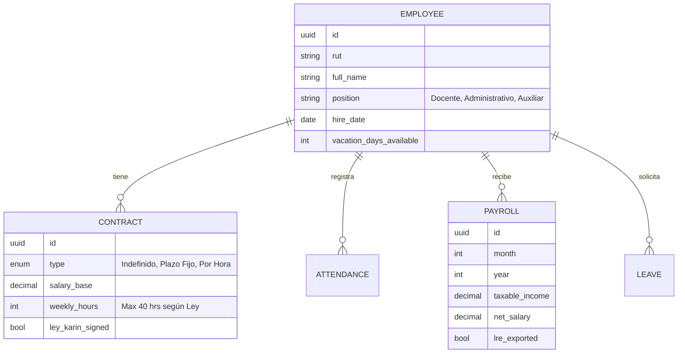

# Plan de Desarrollo: Módulo de Gestión de Personas y RRHH (Normativa Chile 2026)

Este módulo gestiona el capital humano del colegio, asegurando el cumplimiento con la Dirección del Trabajo (DT) y la optimización de remuneraciones.

---

## 1. Arquitectura de Datos (ERD)



---

## 2. Cumplimiento Normativo Chile 2026

### A. Ley de 40 Horas
- **Motor de Reglas:** Validación en Rust para que ningún contrato o anexo supere las 40 horas semanales.
- **Control de Asistencia:** Marcaje digital con geocerca (geofencing) para personal de terreno o teletrabajo, integrado con la DT.

### B. Libro de Remuneraciones Electrónico (LRE)
- Módulo de auditoría antes de la exportación para asegurar que los haberes (imponibles y no imponibles) coincidan con los códigos de la DT.

### C. Ley Karin (Prevención de Acoso)
- Canal de denuncias integrado con el CRM de "Timeline" del empleado para registrar medidas de resguardo inmediatas.

---

## 3. Funcionalidades de "Auto-consulta" (Self-Service)
Para reducir la carga administrativa, el empleado (Docente/Asistente) tiene su propio panel:
- Descarga de liquidaciones de sueldo firmadas.
- Solicitud de vacaciones con flujo de aprobación (UTP -> Dirección -> RRHH).
- Carga de certificados de títulos y capacitaciones.

---

## 4. Implementación Técnica (Rust)

### Backend (Remuneraciones)
Usaremos el crate `rust_decimal` para precisión financiera total.
```rust
pub struct PayrollCalculator {
    pub base_salary: Decimal,
    pub gratificacion: Decimal, // 25% con tope legal
    pub afp_rate: Decimal,
    pub isapre_fixed_amount: Option<Decimal>,
}

impl PayrollCalculator {
    pub fn calculate_liquid(&self) -> Decimal {
        // Lógica de cálculo de impuestos de segunda categoría y descuentos legales
    }
}
```

---

## 5. Etapas de Desarrollo

1. **Mes 1:** Ficha del empleado, gestión documental y contratos (Firma digital).
2. **Mes 2:** Motor de asistencia y gestión de vacaciones (Cálculo de días progresivos).
3. **Mes 3:** Módulo de Remuneraciones, Previred y exportador LRE.
4. **Mes 4:** Panel de auto-consulta y flujos de aprobación.
